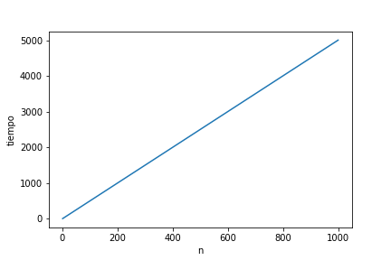
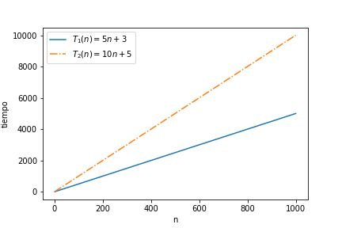
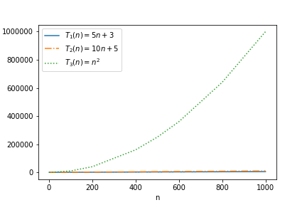
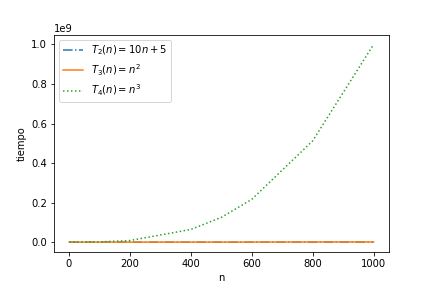

Las técnicas de análisis de algoritmos permiten responder a algunas de las preguntas sobre eficiencia que un diseñador de algoritmos podría formularse, principalmente *¿cuánto tiempo va a tardar la ejecución de mi algoritmo?*, y *¿cuánta memoria va a consumir mi algoritmo?*

El análisis de algoritmos es de suma utilidad pues permite determinar si un algoritmo es adecuado para la resolución de un problema. Por ejemplo, un algoritmo podría representar una solución válida para algún problema complejo, pero la ejecución de dicha solución podría tomar diez años, entonces el algoritmo aunque válido tiene en realidad dudoso valor práctico.

Este tipo de análisis también permite comparar diversos algoritmos que resuelven un mismo problema, ayudando a determinar ¿cuál es la mejor solución?, y ¿porqué?

Finalmente, permite lograr una comprensión profunda del algoritmo, lo que puede llevar a implementaciones cada vez más eficientes.

Para acercarnos a las preguntas sobre tiempo de ejecución y consumo de memoria, es necesaria una perspectiva teórica y por tanto hablamos de análisis de *complejidad temporal* y de *complejidad espacial*.

Esta perspectiva teórica permite establecer una independencia entre el algoritmo como modelo abstracto y sus características concretas de implementación, incluyendo las propias de la máquina que lo ejecutará.

Esta independencia es necesaria para poder establecer conclusiones generales sobre la eficiencia de un algoritmo.

Existe una gran cantidad de instancias de máquinas diferentes entre si que son capaces de ejecutar algoritmos, cada una con sus propias características de construcción. Realizar un análisis del algoritmo para una máquina especifica limitaría las conclusiones e implicaría la necesidad de repetir dicho análisis al considerar otra máquina diferente. Incluso entre máquinas con características similares, la carga de trabajo de cada máquina podría contribuir a producir diferencias entre las observaciones del algoritmo en cuestión. Adicionalmente, las máquinas están en constante evolución, nuevas implementaciones surgen con frecuencia.

En un capítulo anterior hablamos de cómo la eficiencia algorítmica tiene una dimensión fundamentalmente práctica. Y sin embargo, ahora nos encontramos con la necesidad de establecer un nivel de abstracción que nos permita alejarnos de los detalles diferenciadores entre las múltiples máquinas físicas posibles.

La solución a este contradictorio dilema es utilizar una máquina virtual. Esta máquina debe tomar en cuenta los detalles importantes sobre procesamiento y almacenamiento dejando de lado el resto de detalles técnicos que podrían interponerse a nuestro objetivo de generalización.

## Modelo RAM ##

La máquina de acceso aleatorio, RAM por sus siglas en inglés, es una máquina teórica basada en una arquitectura de registros, de procesamiento lineal y funcionalmente equivalente a una máquina de Turing.

No entraremos en detalles sobre la arquitectura o programación de este máquina, pero si sacaremos provecho sobre la simple utilización de recursos que permite.

Con respecto a la utilización de tiempo el modelo RAM hace una diferenciación entre operaciones simples y complejas. Cada operación simple --por ejemplo las operaciones aritméticas, las operaciones lógicas o el condicional `if`-- toma exactamente una unidad de tiempo en ejecutarse, a esta unidad le llamaremos *paso*.

Las operaciones complejas corresponden a ciclos y procedimientos y podemos entenderlas como composiciones de operaciones simples y complejas. El tiempo, o número de pasos, requeridos para completar una operación compleja será equivalente a la cantidad de pasos requeridos para completar cada una de las operaciones que la componen.

Cada acceso a memoria, ya sea de lectura o de escritura, toma exactamente un paso en ejecutarse.

Este modelo pasa por alto detalles comúnes sobre las máquinas reales, por ejemplo la multiplicación es usualmente una operación más compleja que la suma y por tanto toma más tiempo en ser ejecutada; el tiempo de los accesos a memoria podrían variar dependiendo de si los datos están en caché o en memoria principal.

Podemos aplicar este modelo simplificado de complejidad temporal y obtener conclusiones válidas gracias a que lo utilizaremos en conjunto con un modelo matemático de análisis asintótico donde lo importante es la tasa de crecimiento de las funciones más que su forma exacta. En un próximo capítulo hablaremos más en detalle sobre análisis asintótico.

(@ej_fact) **Ejemplo**. Factorial. 

```{#alg_fact .python .numberLines startFrom="1"}
def factorial(x):
    f = 1
    while x > 0:
        f = f * x
        x = x - 1

    return f
```

Línea    Costo    Veces
-----    -----    -----
2        1        1
3        1        $n + 1$
4        2        $n$
5        2        $n$
7        1        1

Table: Análisis de tiempo para `factorial` utilizando el modelo RAM \label{tab_fact}

El ejemplo (@ej_fact) ilustra una aplicación del modelo RAM para el análisis de la complejidad temporal de una versión iterativa del algoritmo para calcular el factorial de un número $n$.

La tabla \ref{tab_fact} muestra un análisis de tiempo línea por línea. La columna *Línea* indica el número de línea en el algoritmo; *Costo* indica el número de pasos involucrados en esa línea de acuerdo con el model RAM; y *Veces* indica cuántas veces se ejecutará esa línea cuando se corra el algoritmo.

La cantidad de veces que se ejecuten las líneas 3, 4 y 5 dependerá del número que entre como argumento a la función, y por tanto el valor se especifica como una variable $n$ dependiente de la entrada más que como una constante predeterminada. En este caso particular, el tamaño de la entrada es el número $x$ que entra como argumento, pues el ciclo está condicionado en términos de $x$.

\begin{equation}
n = x
\end{equation}

Las líneas 4 y 5 tienen un costo de 2 pasos pues cada línea realiza una operación aritmética y una asignación de memoria.

La línea 3 se ejecutará $n + 1$ veces pues va de $n$ a 0, por ejemplo si se ejecuta la función factorial con $n = 5$, la línea 3 se ejecutará 6 veces con los valores 5, 4, 3, 2, 1 y 0 en cada respectiva iteración, y es hasta la última iteración cuando $n = 0$ que la condición se dejará de cumplir y por tanto se romperá el ciclo para posteriormente ejecutar la línea 7.

Gracias a este análisis línea por línea, podemos expresar la complejidad temporal del algoritmo del ejemplo (@ej_fact) como una función $T(n)$, donde $n$ corresponde al tamaño de la entrada. Podemos definir a $T(n)$ como la suma de cada fila de la tabla \ref{tab_fact}, donde cada fila será un término definido como $(Veces \times Costo)$.

\begin{equation}
T(n) = (1 \times 1) + ((n + 1) \times 1) + (n \times 2) + (n \times 2) + (1 \times 1)
\end{equation}

\begin{equation}
T(n) = 1 + (n + 1) + 2n + 2n + 1
\end{equation}

\begin{equation}
T(n) = 5n + 3
\end{equation}

{#fig:alg_fact_Tn}

### Complejidad espacial ###

El modelo RAM simplifica y abstrae la medición del consumo de memoria de manera análoga a como lo hace para el consumo de tiempo de procesamiento.

En este modelo cada parámetro y variable local de tipo primitivo consume una unidad de memoria. Un arreglo de tamaño `n` consume `n` unidades de memoria. Por otro lado, para calcular el consumo de memoria de un objeto complejo es necesario sumar las unidades de cada uno de sus componentes.

(@ej_mult) **Ejemplo**. Multiplicación.

```{#alg_mult .python .numberLines startFrom="1"}
def mult(a, b):
    r = a * b
    return r
```

De esta forma, el algoritmo del ejemplo (@ej_mult) consume en la línea 1 dos unidades, una por cada parámetro `a` y `b`. En la línea 2 consume una unidad más para la variable local `r`. Por tanto, su complejidad espacial se puede expresar como una función $S(n)$.

\begin{equation}
S(n) = 1 + 1 + 1
\end{equation}

\begin{equation}
S(n) = 3
\end{equation}

(@ej_long) **Ejemplo**. Longitud de una hilera.

```{#alg_long .c .numberLines startFrom="1"}
int longitud(const char* S)
{
    int i = 0;
    while (S[i] != '\0') {
        i += 1;
    }

    return i;
}
```

Para analizar el caso del ejemplo (@ej_long) es necesario recordar que una hilera en C se representa como un arreglo de caracteres que siempre finaliza con el caracter nulo `'\0'`. Entonces, el parámetro en la línea 1 consume `n` unidades de memoria, mientras que la variable local `i` en la línea 3 consume 1 unidad. Por lo tanto su función $S(n)$ se especifica como

\begin{equation}
S(n) = n + 1
\end{equation}

(@ej_pend) **Ejemplo**. Pendiente de una recta.

```{#alg_pendiente .c .numberLines startFrom="1"}
typedef struct {
    double x;
    double y;
} punto_t;

double pendiente(punto_t a, punto_t b)
{
    double m = (b.y - a.y) / (b.x - a.x);
    return m;
}
```

En el ejemplo (@ej_pend) los objetos de tipo `punto_t` consumen dos unidades de memoria, una unidad por el dato `x` y una unidad por `y`. La función `pendiente` tiene entonces una complejidad espacial de

\begin{equation}
S(n) = 2 + 2 + 1 = 5
\end{equation}

Es importante recordar que cuando una función o procedimiento termina su ejecución toda la memoria que le haya sido asignada para parámetros y variables locales es liberada.

(@ej_puntos) **Ejemplo**. Múltiples pendientes.

```{#alg_puntos .c .numberLines startFrom="1"}
double[] foo(punto_t a, punto_t b, punto_t c, punto_t d)
{
    double ms[2];
    ms[0] = pendiente(a, b);
    ms[1] = pendiente(c, d);

    return ms;
}
```

Así, el algoritmo del ejemplo (@ej_puntos) utiliza ocho unidades de memoria en la línea 1, dos por cada parámetro; dos unidades para el arreglo `ms` en la línea 2, y tan solo cinco unidades —en lugar de diez— para ambas llamadas a `pendiente`. Es decir, las cinco unidades que se consumen en la línea 4 serán reutilizadas en la siguiente llamada a `pendiente` en la línea 5.

\begin{equation}
S(n) = (2 + 2 + 2 + 2) + 2 + 5 = 15
\end{equation}

Sin embargo, es importante notar que con las llamadas recursivas de pila es necesario contabilizar la memoria utilizada por cada llamada. Recordemos que la recursividad de pila deja cálculos pendientes y, por lo tanto, la memoria no puede ser liberada hasta que estos sean resueltos.

(@ej_factrec) **Ejemplo**. Factorial recursivo de pila.

```{#alg_factrec .python .numberLines startFrom="1"}
def factorial(x)
{
    if x == 0:
        return 1
    else:
        return x * factorial(x - 1)
}
```

En el caso del ejemplo (@ej_factrec) cada llamada consume una unidad de memoria correspondiente al parámetro `x`, sin embargo es necesario contabilizar cada llamada pues la memoria no se liberará hasta que todos los cálculos estén completos. Si invocamos la función `factorial(5)`, la recursión hará seis llamadas para los valores $5, 4, 3, 2, 1, 0$; en términos generales la función ejecutará `n + 1` llamadas para cualquier número `n` que reciba como parámetro. Por lo tanto

\begin{equation}
S(n) = n + 1
\end{equation}

Finalmente, es importante tomar en cuenta si los parámetros que recibe la función a analizar están siendo pasados por valor o por referencia. Cuando los parámetros se pasan por referencia, se está compartiendo memoria entre la función que invoca y la función invocada, y por tanto su consumo sólo debe ser contabilizado una vez.

(@ej_ref) **Ejemplo**. Paso de parámetros por referencia.

```{#alg_ref .c .numberLines startFrom="1"}
double pendiente(punto_t* a, punto_t* b)
{
    double m = (b->y - a->y) / (b->x - a->x);
    return m;
}

double[] goo(punto_t a, punto_t b, punto_t c, punto_t d)
{
    double ms[2];
    ms[0] = pendiente(&a, &b);
    ms[1] = pendiente(&c, &d);

    return ms;
}
```

En el ejemplo (@ej_ref) la función `pendiente` recibe ahora punteros a objetos de tipo `punto_t` y por tanto en lugar de contabilizar dos unidades por cada parámetro (según el tamaño del objeto), contabilizaremos tan solo una pues el puntero consume sólo una unidad independientemente del tamaño del objeto apuntado. Por tanto, esta versión de la función `pendiente` tendrá una complejidad espacial $S(n) = 3$.
Por su parte, la función `goo` consume ocho unidades en la línea 7, más dos unidades en la línea 9, más tres unidades en la línea 10 que serán reutilizadas en la línea 11. Por tanto

\begin{equation}
S(n) = (2 + 2 + 2 + 2) + 2 + 3 = 13
\end{equation}

### Interpretación de las funciones $T(n)$ y $S(n)$ ###

Las funciones $T(n)$ y $S(n)$ brindan información sobre el consumo de recursos del algoritmo con respecto al tamaño de su entrada.

Puesto que nuestros análisis deben mantener independencia de la plataforma física sobre la que se ejecuten los algoritmos, no prestaremos atención a los valores puntuales que se puedan calcular con estas funciones, sino más bien a su comportamiento general.

Consideremos por ejemplo un algoritmo cuya complejidad temporal se representa con al siguiente función $T(n)$.

$$T(n)=5n + 3$$

Podemos determinar que $T(10) = 53$ o que $T(1000) = 5003$. Además, podríamos encontrar una función para estimar a cuántos segundos equivale el valor $53$ para una máquina específica. Sin embargo, estos datos no son de mucha ayuda para generalizar el comportamiento de la función, y por tanto defender o criticar la eficiencia del algoritmo correspondiente en cuanto al consumo de recursos, puesto que sería necesario obtener una muestra estadísticamente significativa de todos los posibles valores para todas las posibles máquinas, una tarea titánica y poco práctica que deberíamos completar para cada algoritmo a analizar.

Por otro lado, si comparamos dos funciones como las siguientes $T_1$ y $T_2$.

{#fig:T1n_T2n}

Podemos observar que consistentemente $T_1(n) < T_2(n), \forall n \geq 0$.

Es posible entonces afirmar que $T_1$ es más eficiente, pues consume menos unidades de tiempo que $T_2$, independiente de cómo se traduzcan estas a segundos en una máquina particular. También observamos que esta diferencia se hace más evidente conforme el tamaño de la entrada $n$ crece. Desde una perspectiva práctica, queremos saber si nuestro algoritmo escalará eficientemente cuando tenga que procesar grandes cantidades de datos; y sabemos que usualmente los algoritmos se ejecutan de manera casi inmediata cuando son invocados con una pequeña de cantidad de datos.

De esta forma, prestaremos más atención al comportamiento de las funciones conforme crezca el tamaño de la entrada, más que a valores puntuales de las mismas.

Observemos qué sucede cuando comparamos $T_1$ y $T_2$ con una tercera función $T_3$.

{#fig:T1n_T2n_T3n}

Sabemos que $T_2$ crece más que $T_1$ conforme $n$ aumenta. También sabemos que tanto $T_1$ como $T_2$ son funciones lineales, pues cumplen con la ecuación $y = mx + b$. Sin embargo, la diferencia entre $T_1$ y $T_2$ palidece cuando introducimos la función cuadrática $T_3$. La función cuadrática crecerá en una tasa significativamente más alta que cualquier función lineal.

De igual forma, si agregamos una función cúbica, está crecerá en una tasa mucho mayor que las cuadráticas, y definitivamente que las lineales.

{#fig:T2n_T3n_T4n}

A partir de esta observación, podemos concluir que las funciones $T(n)$ y $S(n)$ lineales son más eficientes que las cuadráticas, y estas a su vez más eficientes que las cúbicas. A grandes rasgos, son casos más deseables aquellos algoritmos que produzcan funciones logarítmicas y lineales sobre algoritmos de los que se deriven funciones cuadráticas, cúbicas, o exponenciales, entre otras.

Puesto que estamos prestando especial atención al crecimiento de las funciones y no tanto a sus detalles específicos, podemos simplificar las expresiones que definen a las funciones $T(n)$ y $S(n)$ para tomar en cuenta únicamente su término de mayor crecimiento.

Por ejemplo, para un $T(n) = 3n + 10$ tenemos los términos $3n$ y $10$, tomamos el de mayor crecimiento $3n$, y descartamos la constante $3$ quedando entonces con $n$. Por tanto, decimos que $T(n) = \mathcal{O}(n)$.

De igual manera, si $T(n) = 5n^3 + 2n^2 + 100n + 3$, tenemos los términos $5n^3$, $2n^2$, $100n$ y $3$, tomamos el de mayor crecimiento $5n^3$ y descartamos la constante $5$ para obtener $T(n) = \mathcal{O}(n^3)$.

Esta ha sido una introducción intuitiva y bastante informal al uso de notación $\mathcal{O}$-grande para categorizar las funciones $T(n)$ y $S(n)$ según su crecimiento y poder así compararlas y evaluar su eficiencia.

Sin embargo, surgen preguntas que debemos responder. ¿Cómo podemos formalizar el concepto de crecimiento para así comparar distintas funciones? ¿Por qué podemos descartar los términos de menor crecimiento con tanta seguridad? ¿Por qué podemos descartar las constantes? ¿Qué tipo de objeto matemático es $\mathcal{O}$ y porqué podemos relacionarlo con $T(n)$ utilizando el operador $=$? ¿Cuál es la jerarquía que existe entre las distintas categorías de funciones según su crecimiento? ¿Cómo se define esta jerarquía?

Para acercarnos a estas y otras posibles preguntas que hayan surgido después de la lectura de este capítulo, estudiaremos en el próximo la teoría de análisis asintótico, una herramienta matemática formal que nos permitirá definir, demostrar y justificar los conceptos intuitivos que hemos introducido en esta sección.

### Ejercicios ###

1. Determine la complejidad temporal para una función que calcula fibonacci iterativamente.

2. Determine la complejidad espacial para una función recursiva de pila que calcula el factorial de un entero.

3. Determine la complejidad temporal para una función que calcula la media aritmética de una lista de números.

4. Determine la complejidad espacial para una función que concatena dos hileras.

5. Determine la complejidad temporal para una función que multiplica dos matrices.

6. Determine la complejidad espacial para una función que multiplica dos matrices.

7. Determine la complejidad temporal para una función que chequea si una lista de números está ordenada ascendentemente.

8. Determine la complejidad espacial para una función que chequea si una lista de números tiene elementos duplicados.

9. Determine la complejidad temporal para una función que encuentra la moda de una lista de números.

10. Determine la complejidad espacial para una función que encuentra la moda de una lista de números.

## Referencias ##

(ND) EECS 311: Space Complexity. Recuperado en Julio 2019 de: https://www.cs.northwestern.edu/academics/courses/311/html/space-complexity.html

Aho A., Hopcroft J., Ullman J. (1974) The Design and Analysis of Computer Algorithms. Addison-Wesley.

Skiena S. (2010) The Algorithm Design Manual (2da ed.) Springer.
