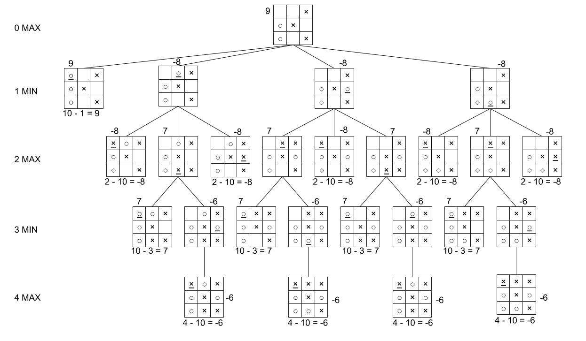
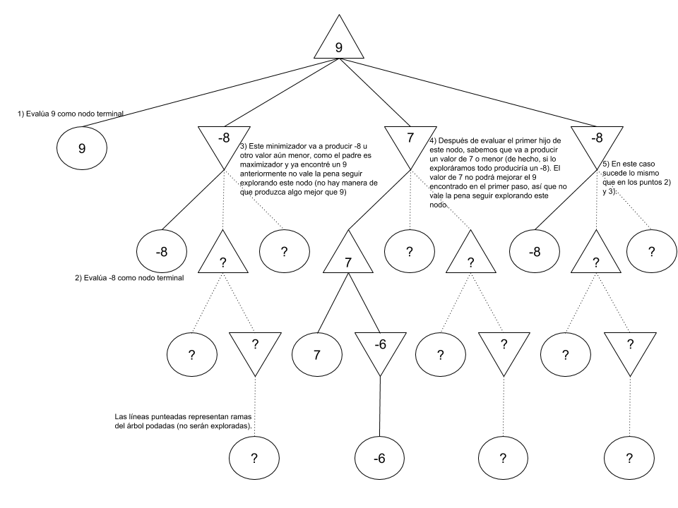

Los árboles de juego constituyen un serie de técnicas algorítmicas que permiten resolver problemas en escenarios de competencia que llamaremos *juegos* en el contexto de la teoría de juegos[^1]. Particularmente hablaremos de juegos de suma-cero entre dos agentes.

[^1]: Teoría matemática que modela conflictos y cooperación entre **agentes racionales**.

Los juegos de suma cero son aquellos en los que el valor de ganancia del agente $A$ corresponde exactamente al valor de pérdida del agente $B$ y viceversa.

Por ejemplo, en el juego de ajedrez es posible asignar valores relativos a las piezas. La torre es una pieza que tiene un valor relativo de 5. Si el jugador de las piezas negras captura la torre del jugador de las blancas, entonces podemos decir que el jugador de las negras gano +5 mientras que su oponente perdió -5. En un juego de suma cero, la suma de ganancias y pérdidas de los jugadores siempre resulta en cero.

Los árboles de juego se construyen cuando los jugadores toman turnos modificando el estado del juego hasta que alguno de los dos gana o se llega a un empate. El objetivo de los árboles de juego es encontrar la serie de movimientos que puede realizar un jugador para maximizar su ganancia.

Utilizaremos el clásico juego de gato (también conocido como tic-tac-toe o $\times /\circ$) para ejemplificar los algoritmos de árboles de juego.

## Algoritmo minimax

Este algoritmo genera un árbol de juego en el que el primer nivel corresponde a todos los movimientos posibles para el jugador $A$, el segundo nivel corresponde a la réplica del jugador $B$ y así sucesivamente hasta llegar a nodos hoja donde ya no hay más movimientos posibles.

El algoritmo es recursivo, y en cada llamada cambia el jugador de turno. El algoritmo asume que el oponente es un jugador experto y siempre realizará su mejor movida posible.

La figura 1 demuestra una corrida del algoritmo iniciando en un estado adelantado del juego. El nivel 0 (la raíz) representa el estado del juego luego de una movida de $\times$, nuestro oponente. El siguiente nivel (1) se compone de todos los movimientos posibles para $\circ$, nuestro jugador. El nivel 2 se construye con los siguientes movimientos posibles de $\times$ y así sucesivamente.

Cada nodo tendrá un valor asociado que se calcula de abajo hacia arriba. Los nodos hoja representan estados finales del juego --cuando ya no hay más movimientos posibles--. Para el caso de nuestro ejemplo se definen las siguientes heurísticas: ganar se evalúa con $10$, perder con $-10$ y empatar con $0$.

De manera más específica, los nodos hoja que finalizan con nuestro jugador ganando se evalúan con un $10 - profundidad$, los que finalizan con el oponente ganando se evalúan con $profundidad - 10$, y los empates se mantienen en $0$.

Los nodos que no son hoja se califican de acuerdo al nivel que pertenezcan. Para los niveles correspondientes a nuestro jugador, el nodo se calificará tomando el máximo valor de sus hijos. Mientras que para los nodos en niveles del oponente, se tomará el mínimo valor de sus hijos.

El algoritmo 1 describe al algoritmo minimax.

\begin{algorithm}
\caption{Minimax}
\label{minimax}
\algrenewcommand\algorithmicend{}
\algrenewcommand\algorithmicprocedure{\textbf{proc}}
\algrenewcommand\algorithmicwhile{\textbf{mientras}}
\algrenewcommand\algorithmicfor{\textbf{para todo}}
\algrenewcommand\algorithmicdo{}
\algrenewcommand\algorithmicif{\textbf{\mbox{¿}}}
\algrenewcommand\algorithmicthen{\textbf{\mbox{?}}\ :}
\algrenewcommand\algorithmicelse{\textbf{sino}\ :}
\begin{algorithmic}
\Procedure {Minimax}{$E_{actual}$, $profundidad = 0$, $turno = Jugador$}
  \If{$\Call{EsHoja}{E_{actual}}$}
    \If{$\Call{GanaJugador}{E_{actual}}$}
      \State $\uparrow 10 - prof$
    \EndIf
    \If{$\Call{GanaOponente}{E_{actual}}$}
      \State $\uparrow prof - 10$
    \Else
      \State $\uparrow 0$
    \EndIf
  \EndIf

  \If{turno = Jugador}
    \State $mejor \gets -\infty$
    \For $E_{nuevo} \in \Call{Movimientos}{E_{actual}}:$
      \State $valor \gets \Call{Minimax}{E_{nuevo}, profundidad + 1, turno = Oponente}$
      \If{$valor > mejor$}
        \State $mejor \gets valor$
      \EndIf
    \EndFor
  \Else
    \State $mejor \gets \infty$
    \For $E_{nuevo} \in \Call{Movimientos}{E_{actual}}:$
      \State $valor \gets \Call{Minimax}{E_{nuevo}, profundidad + 1, turno = Jugador}$
      \If{$valor < mejor$}
        \State $mejor \gets valor$
      \EndIf
    \EndFor
  \EndIf

  \State $\uparrow mejor$

\EndProcedure
\end{algorithmic}
\end{algorithm}

### Preguntas generadoras

* ¿Qué limitaciones encontramos al aplicar este algoritmo a un juego como el ajedrez, donde cada estado tiene en promedio 30 movimientos posibles?

* ¿Qué papel juega el parámetro de $profundidad$ en este algoritmo? ¿Qué se pretende lograr con su utilización en la evaluación de los nodos hoja?

* ¿Porqué podríamos considerar a este algoritmo como inteligencia artificial?

## Podas Alfa Beta

Dependiendo del problema que se esté modelando, el algoritmo de minimax puede producir un altísimo nivel de ramificación, con el potencial de tornarse intratable.

El algoritmo de podas alfa beta es una mejora sobre el minimax. Se aprovecha de las conclusiones que podemos derivar del hecho de que algunos niveles maximizan valores mientras que otros minimizan. Estos resultados lógicos nos van a permitir determinar si es necesario explorar los siguientes nodos del árbol de juegos o no.

El funcionamiento del algoritmo se ejemplifica en la figura 2. El árbol representa el mismo juego de la figura 1 que utilizamos para el algoritmo minimax. Sin embargo, los nodos en lugar de representarse como estados del juego, los representaremos con un triángulo apuntando hacia arriba si pertenecen a un nivel de maximización, un triángulo apuntando hacia abajo si más bien minimizan, o un circulo si son hojas.

El algoritmo iniciará su funcionamiento de la misma forma que el minimax, en el punto (1) evaluará el primer hijo de izquierda a derecha como una hoja que produce un valor de 9. Luego procederá a evaluar al segundo hijo, el recorrido recursivo nos lleva a evaluar la hoja en el punto (2) y a asignar temporalmente el valor de -8 al segundo hijo.

En este punto ya podemos derivar nuestra conclusión sobre esta rama --punto (3)--: puesto que el segundo hijo es un minimizador y tiene un valor temporal de -8, concluímos que este nodo puede finalizar con un valor que puede ser menor o igual a -8. Además sabemos que su hermano, el hijo 1, ya tiene un valor de 9. Por tanto, explorar el resto de ramas del hijo 2 no nos ayudará a producir un valor mejor que 9 para su padre el maximizador --el nodo raíz--. De esta forma, detenemos la exploración del hijo 2 y procedemos a explorar el hijo 3.

Después de explorar la primer rama del hijo 3 --punto (4)-- sabemos que producirá un valor menor o igual a 7. Este nodo tampoco podrá superar al hijo 1 con su valor de 9 y por tanto no se explorará más allá.

Finalmente, el hijo 4 tiene el mismo comportamiento que el hijo 2 --punto (5)--.

Con estas podas logramos determinar la mejor movida sin necesidad de explorar el árbol completo. En el caso de nuestro ejemplo sólo exploramos el 38% del árbol para determinar la mejor movida posible.

El algoritmo 2 describe al algoritmo alfa beta. El algoritmo utiliza dos parámetros extra: el parámetro $\alpha$ registra el mejor valor encontrado para el maximizador hasta el momento, mientras que el parámetro $\beta$ registra el mejor valor encontrado para el minimizador hasta el momento. Estos valores van cambiando conforme avanza el recorrido y son locales para cada nodo padre.

\begin{algorithm}
\caption{AlfaBeta}
\label{alfabeta}
\algrenewcommand\algorithmicend{}
\algrenewcommand\algorithmicprocedure{\textbf{proc}}
\algrenewcommand\algorithmicwhile{\textbf{mientras}}
\algrenewcommand\algorithmicfor{\textbf{para todo}}
\algrenewcommand\algorithmicdo{}
\algrenewcommand\algorithmicif{\textbf{\mbox{¿}}}
\algrenewcommand\algorithmicthen{\textbf{\mbox{?}}\ :}
\algrenewcommand\algorithmicelse{\textbf{sino}\ :}
\begin{algorithmic}
\Procedure {AlfaBeta}{$E_{actual}$, $prof = 0$, $turno = Jugador$, $\alpha=-\infty$, $\beta = \infty$}
  \If{$\Call{EsHoja}{E_{actual}}$}
    \If{$\Call{GanaJugador}{E_{actual}}$}
      \State $\uparrow 10 - prof$
    \EndIf
    \If{$\Call{GanaOponente}{E_{actual}}$}
      \State $\uparrow prof - 10$
    \Else
      \State $\uparrow 0$
    \EndIf
  \EndIf

  \If{turno = Jugador}
    \State $mejor \gets -\infty$
    \For $E_{nuevo} \in \Call{Movimientos}{E_{actual}}:$
      \State $valor \gets \Call{AlfaBeta}{E_{nuevo}, prof + 1, turno = Oponente, \alpha, \beta}$
      \If{$valor > mejor$}
        \State $mejor \gets valor$
      \EndIf
      \If{$valor \geq \beta$}
        \State $\uparrow valor$ \Comment{No va a poder mejorar al mejor mínimo actual}
      \EndIf
      \If{$valor > \alpha$}
        \State $\alpha \gets valor$
      \EndIf
    \EndFor
  \Else
    \State $mejor \gets \infty$
    \For $E_{nuevo} \in \Call{Movimientos}{E_{actual}}:$
      \State $valor \gets \Call{AlfaBeta}{E_{nuevo}, prof + 1, turno = Jugador, \alpha, \beta}$
      \If{$valor < mejor$}
        \State $mejor \gets valor$
      \EndIf
      \If{$valor \leq \alpha$}
        \State $\uparrow valor$ \Comment{No va a poder mejorar al mejor máximo actual}
      \EndIf
      \If{$valor < \beta$}
        \State $\beta \gets valor$
      \EndIf
    \EndFor
  \EndIf

  \State $\uparrow mejor$

\EndProcedure
\end{algorithmic}
\end{algorithm}

### Preguntas generadoras

* ¿Cómo mejora este algoritmo la *inteligencia* de minimax?

* ¿Qué situaciones de la vida real se pueden modelar como juegos de suma cero entre dos agentes, tal que puedan ser resueltas por minimax o alfa-beta?
